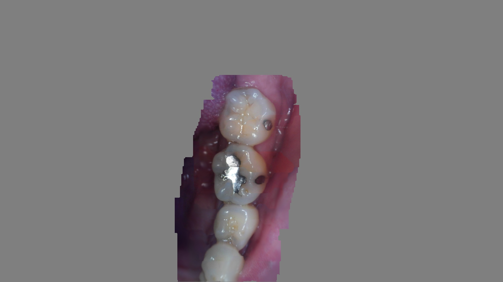
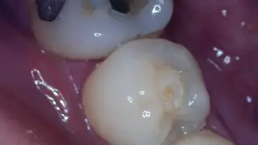
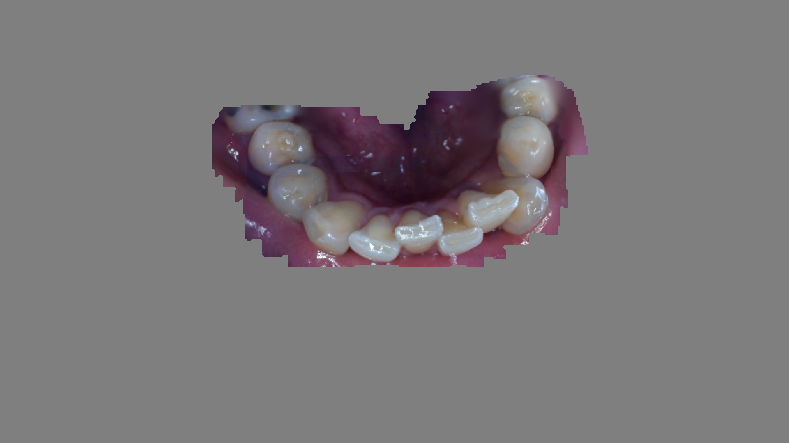
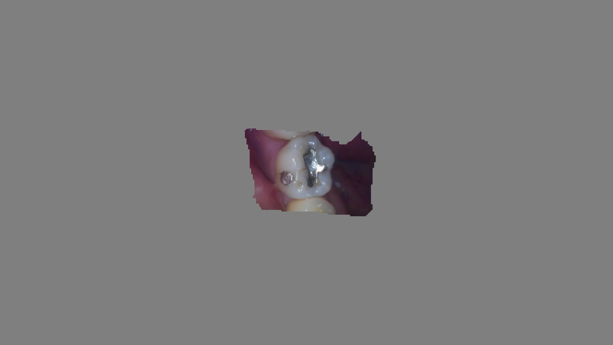

# Smile
This is a personal research project to develop an automated tool that stitches sequences of intraoral images from a low cost dental camera into a synthetic panoramic view.

Status: *Under Development* 
Author: [Mark Hsieh](https://github.com/mcmhsieh) 
Licence: [MIT](LICENSE)

## Examples

| Input frames | Generated output |
| - | - |
|  | 
|  | 

See https://github.com/mcmhsieh/ANESOK-401-frame-recorder for information about the dental camera and recording of image sequences.

## Getting Started (Microsoft Windows)

### Setting up
- Clone https://github.com/mcmhsieh/Smile.git or download a copy of the repository
- If your system supports CUDA, install an up-to-date NVIDIA Graphics Driver[^InstallingCudaRuntime]
- Install Python 3.11 and Python Poetry
- Create a virtual environment, activate it, and use Poetry to install the dependencies[^InstallingPyTorch3D]
  - *the installed dependencies should occupy ~6-7GB of disk space*

### Initial test run on a tiny example dataset
Activate the virtual environment and run the stages of the pipeline in sequence from the cloned repository's `smile` subdirectory:

    cd smile
    python.exe calc_sequential_flow_and_blur.py
    python.exe select_key_frames.py
    python.exe stitch_key_frames.py
    python.exe select_and_position_inter_key_aux_frames.py
    python.exe compute_depth_images.py
    python.exe integrate_depth_images.py
    python.exe view_synthesis.py

If everything is installed and working correctly, the smallest (almost minimal) example dataset of JPEG images included in the cloned repository's `pipeline-input/example-30frames-iso46to46` subdirectory should be stitched together to generate a synthetic view saved as a JPEG image (with a timestamped filename) in the `pipeline-workspace/example-30frames-iso46to46/view_synthesis` subdirectory. The entire pipeline sequence may take over 7 minutes to complete depending on your system[^ExecutionTimes].

## Other example datasets

The repository's `pipeline-input` subdirectory includes:
- `example-273frames-iso34to37`
- `example-351frames-iso45to35`

To run the pipeline on a specific dataset, write the name of the subdirectory into a text file `pipeline-workspace/working_subdir.txt` in the cloned repository before running the pipeline.

For example:

    cd smile
    echo example-273frames-iso34to37> ..\pipeline-workspace\working_subdir.txt
    python.exe calc_sequential_flow_and_blur.py
    python.exe select_key_frames.py
    python.exe stitch_key_frames.py
    python.exe select_and_position_inter_key_aux_frames.py
    python.exe compute_depth_images.py
    python.exe integrate_depth_images.py
    python.exe view_synthesis.py

The entire pipeline sequence may take over 30 minutes to complete for either dataset depending on your system[^ExecutionTimes].

Note that if `pipeline-workspace/working_subdir.txt` does not exist, then the pipeline selects the smallest dataset. After running the pipeline in the section [Initial test run on a tiny example dataset](#initial-test-run-on-a-tiny-example-dataset), the pipeline should have written `example-30frames-iso46to46` to `pipeline-workspace/working_subdir.txt`.

[^InstallingCudaRuntime]: There should be no need to separately install the CUDA runtime because it is already bundled with PyTorch

[^InstallingPyTorch3D]: PyTorch3D has been included as a submodule because [installing](https://github.com/facebookresearch/pytorch3d/blob/main/INSTALL.md) it as a package is not straightforward. It has [*"tight build time dependencies on versions of other packages"*](https://github.com/facebookresearch/pytorch3d/issues/1673) and [*"currently no metadata for the build are provided"*](https://github.com/facebookresearch/pytorch3d/issues/1419). Consequently [Poetry is unable to install PyTorch3D](https://github.com/python-poetry/poetry/issues/8574). All the [prebuilt wheels](https://github.com/facebookresearch/pytorch3d/issues/1401) and [conda packages](https://anaconda.org/pytorch3d/pytorch3d/files/manage) appear to be for linux and limited to Python versions below 3.11.

[^ExecutionTimes]: Advisory execution times were measured on an ASUS TUF A15 FA506IU comprising AMD Ryzen 7 4800H, 32GB RAM, NVIDIA GeForce GTX 1660 Ti 6GB